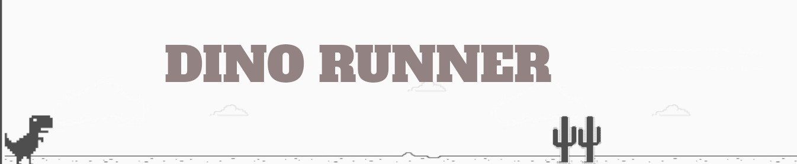

# Projeto: Recriando o famoso jogo do dinossauro sem internet

Neste projeto você terá o desafio de criar uma cópia do jogo do dinossauro, famoso no Chrome por nos entreter quando estamos sem conexão. Nele iremos utilizar HTML, CSS e JavaScript, abordando de maneira simples diversos conceitos introdutórios importantes para programação na web como tags básicas de HTML, manipulação de eventos, funções e manipulação de elementos HTML usando JavaScript, estilização e animações básicas com CSS.

## Tecnologias

* HTML5
* CSS3
* Javascript

## Instrutor(a)

Celso Henrique

Engineering Lead

## Entidade

Digital Inovation one 

## Autor
Edson souza

[Linkedin](https://www.linkedin.com/in/edsonfrs/)

[GitHub](https://github.com/Edsonfrs)

